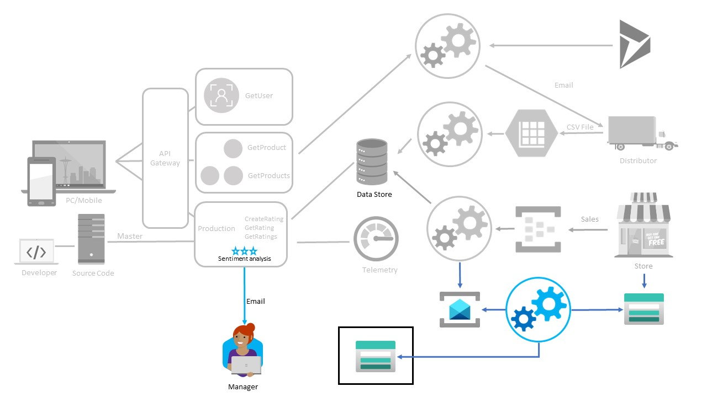

# Alerting and notification

## Progress Diagram



## Happy Path

* Edit the existing CreateRating function and put userNotes through either:
    * Text Analytics Cognitive Services API calls
    * [TextBlob](https://textblob.readthedocs.io/en/dev/index.html#) library using Python functions
* Create Custom Telemetry to write to the same App Insights instance as the function whenever there’s a bad review
* Use the Log Alerts feature for Application Insights to generate an alert and email when the threshold is reached

[How To - Sentiment Analysis](https://docs.microsoft.com/en-us/azure/cognitive-services/text-analytics/how-tos/text-analytics-how-to-sentiment-analysis?tabs=version-3)  

## Challenge 1: Add Sentiment Analysis and Custom Telemetry

### Step 1: Enable Text Analytics (Azure AI Language)

1. Navigate to Azure portal and create a **Language** service.

1. On the **Select additional features** tab, click on **Continue to create your resource**. Note that, ***Sentiment Analysis*** is one of the default features.

1. On the **Create Language** blade, configure the following settings and click on **Review + Create** and then **Create**.

   - Use the resource group **serverless-openhack**
   - Select your desired region
   - Provide a unique name for your resource
   - Select **Standard - S** as pricing tier
   - Acknowledge the **Responsible Use of AI Documentation for Language** checkbox
  
1. Once the deployment is complete, go to your newly created Language resource, navigate to **Keys and Endpoint** setting from the left navigation pane and note down the **Key** and **Endpoint** in a notepad.

### Step 2: Enable Application Insights on Function App

1. Navigate to your function app and enable **Application Insights**.

1. Once the application insights is enabled for the function app, navigate to your Application Insights resource and note down the **Instrumentation Key** in a notepad.

1. Add the Language service endpoint & key and the instrumentation key variables to your function app.

   - TEXT_ANALYTICS_ENDPOINT = <your language resource endpoint>
   - TEXT_ANALYTICS_KEY = <your key>
   - APPINSIGHTS_INSTRUMENTATIONKEY = <instrumentation key>

### Step 3: Update the `CreateRating` function

1. Update your `CreateRating` function code to fetch the environment variables and provide the sentiment score. Below is a sample code example:

   ```
   using System;
   using System.IO;
   using System.Threading.Tasks;
   using Microsoft.AspNetCore.Mvc;
   using Microsoft.Azure.WebJobs;
   using Microsoft.Azure.WebJobs.Extensions.Http;
   using Microsoft.AspNetCore.Http;
   using Microsoft.Extensions.Logging;
   using Azure;
   using Azure.AI.TextAnalytics;
   using Microsoft.ApplicationInsights;
   using Microsoft.ApplicationInsights.Extensibility;
   using Newtonsoft.Json;
   using Newtonsoft.Json.Linq;

   namespace RatingsFunctionApp
   {
       public static class CreateRating
       {
           private static readonly string endpoint = Environment.GetEnvironmentVariable("TEXT_ANALYTICS_ENDPOINT");
           private static readonly string key = Environment.GetEnvironmentVariable("TEXT_ANALYTICS_KEY");
           private static readonly AzureKeyCredential credentials = new AzureKeyCredential(key);
           private static readonly TextAnalyticsClient textClient = new TextAnalyticsClient(new Uri(endpoint), credentials);

           private static readonly TelemetryClient telemetryClient = new TelemetryClient(
               new TelemetryConfiguration(Environment.GetEnvironmentVariable("APPINSIGHTS_INSTRUMENTATIONKEY"))
           );

           [FunctionName("CreateRating")]
           public static async Task<IActionResult> Run(
               [HttpTrigger(AuthorizationLevel.Function, "post", Route = "ratings")] HttpRequest req,
               ILogger log)
           {
               log.LogInformation("Processing CreateRating request...");

               string requestBody = await new StreamReader(req.Body).ReadToEndAsync();
               JObject data = JsonConvert.DeserializeObject<JObject>(requestBody);

               string userNotes = data["userNotes"]?.ToString() ?? "";
               double sentimentScore = 0.0;

               if (!string.IsNullOrEmpty(userNotes))
               {
                   DocumentSentiment docSentiment = textClient.AnalyzeSentiment(userNotes);

                   foreach (var sentence in docSentiment.Sentences)
                   {
                       if (sentence.Sentiment == TextSentiment.Negative &&
                           sentence.ConfidenceScores.Negative > sentimentScore)
                       {
                           sentimentScore = sentence.ConfidenceScores.Negative;
                       }
                   }

                   data["sentimentScore"] = sentimentScore;

                   if (sentimentScore >= 0.7)
                   {
                       telemetryClient.TrackEvent("NegativeReview",
                           new System.Collections.Generic.Dictionary<string, string>
                           {
                               { "ProductId", data["productId"]?.ToString() },
                               { "UserId", data["userId"]?.ToString() },
                               { "SentimentScore", sentimentScore.ToString("0.00") },
                               { "UserNotes", userNotes }
                           });
                   }
               }

               // Here you would save 'data' into Cosmos DB or another DB
               // Example: await cosmosContainer.CreateItemAsync(data);

               return new OkObjectResult(data);
           }
       }
   }
   ```

1. Test the function with Postman/cURL command to get the sentiment score.

   ```
   POST https://<your-func-app>.azurewebsites.net/api/ratings
   Content-Type: application/json

   {
     "userId": "u123",
     "productId": "icecream-choco",
     "rating": 1,
     "userNotes": "This ice cream tastes horrible and I will not buy again."
   }
   ```

1. In your Application Insights resource run the following query in **Logs**.

   ```
   customEvents
   | where name == "NegativeReview"
   | order by timestamp desc
   ```

## Challenge 2: Email Alert

1. Navigate to **Monitor > Alerts** in Azure portal.

1. Create a new **Action Group** with the following settings:

   - Select the resource group **serverless-openhack**
   - Provide a unique name for your action group
   - Provide a unique display name
  
1. In the **Notifications** tab, select **Email/SMS message/Push/Voice** for Notification type ans select **Email**, then enter your coach's email address. Click on **Review + Create > Create**

1. Again, navigate to **Monitor > Alerts** and create anew **Alert Rule** with the following settings:

   - Select the scope **Application Insights**
   - Condition **Custom Log Search**
   - Paste the query in **Search query**. An example is provided below:
     ```
     customEvents
     | where name == "NegativeReview"
     | where timestamp >= ago(5m)
     | summarize ReviewCount = count()
     ```
   - Select you action group created in the previous step
   - Provide a unique Alert Rule name
   - Click on **Review + Create > Create**

1. Once the alert rule is created, post the negative review to get the email notification.


