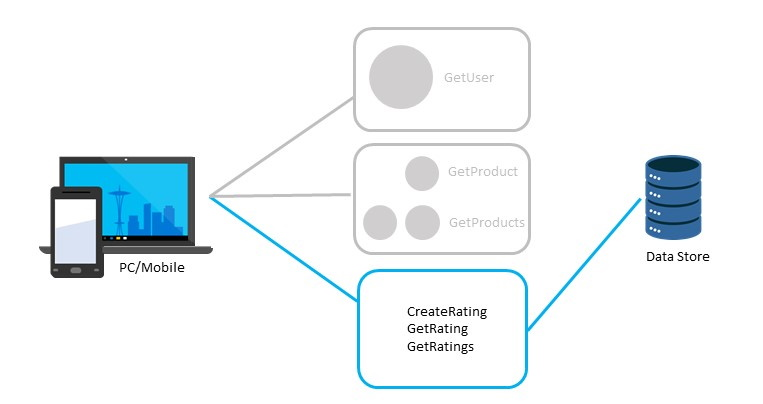

# Finish the Ice Cream Ratings API

## Progress Diagram



## Happy Path

* Put code in GitHub or Azure DevOps or other Git Sources
* Create and Continuously deploy to an Azure Function App
* Use Azure Functions with Cosmos DB, use the functions input and output bindings
* Can use CosmosDB client SDKs too, not tied to bindings
* For Node especially, CosmosDB Mongo API + Mongoose works well

## Coaches Notes

* By the end of this challenge ensure your team has a setup conducive for collaborating and a plan for working together. I.e., ‘how are we going to collab, where are we going to put all the code’
* Good one to try enabling Visual Studio Live Share
* Get the team to discuss how they can split up and then reconverge to share
* Make sure to test their CreateRating function using curl or Postman to ensure the APIs function.
* Get them to use Consumption plan (real serverless)
* When trying to install extensions and getting an error on "cannot find dotnet-add", this is due to old version of .NET, installing latest version of .NET should correct this.
* For GetRatings putting userId into route and using it in the SQLQuery parameter (instead of query string which doesn't work)
* Cosmos DB requires a partition key to be set when creating the container. As a coach, have a conversation with the team about the [choice of a partition key](https://docs.microsoft.com/azure/cosmos-db/partitioning-overview#choose-partitionkey), and how the partition key may impact querying. For example, potential partition keys for this challenge may be ```userId``` or ```productId```.
* Users to use for sending reviews:

User Id​ | User Name​ | Full Name​
--------| --------- | ---------
cc5581ff-6be1-4418-a8d8-55a29c24b995​ | garry.thornburg​ | Garry Thornburg​
6dd3bb49-a5be-41ca-9dac-3b995450f2db​ | kayla.cobb​ | Kayla Cobb​
ed414804-ed3d-4ec3-a283-f94ee86f3e23​ | edna.waters​ | Edna Waters​
d1f80b77-040f-4ec8-a833-90b18da70337​ | chester.furlong​ | Chester Furlong​
cc20a6fb-a91f-4192-874d-132493685376​ | doreen.riddle​ | Doreen Riddle​

### Storage Notes

* CosmosDb
    * Ensure the team discusses the partition key requirement of the collection.
    * Using the id property of the binding will not work without the use of the partition key property as well. The GetRating function will require using the sql query

### Node notes

* Keep check of the WEBSITE_NODE_DEFAULT_VERSION app setting. Depending on the version of function apps being used the Node version in the portal may need to be updated. Refer to the [Language chart](https://docs.microsoft.com/azure/azure-functions/functions-versions#languages) for supported language runtimes.
* To enable debugging in Visual Studio you have to add "NODE_OPTIONS": "--inspect=5858" to the local settings file

### DevOps Notes

* The team can create an AzDo account using the credentials provided by lab provider. 
* If using Azure DevOps for source code but you still want to connect to it from the Functions deployment options, you need to configure from an Organization that your login is the owner of. The deployment configuration will reference [these instructions](https://docs.microsoft.com/azure/devops/organizations/accounts/create-organization?view=azure-devops) for doing so.
    * Linux app service plans do not have Kudu service available so therefore cannot use this option for deployment configuration
* See [Deployment technology availability](https://docs.microsoft.com/azure/azure-functions/functions-deployment-technologies#deployment-technology-availability) for available deployment options based on App Service plan selections.

## Challenge Steps:

### CreatRating.cs function

1. Navigate to your **serverlessohproduct** function app and create a new function with **HTTP** trigger and name **CreateRating**.

1. Replace the run.csx file with the below code:

   ```
   #r "Newtonsoft.Json"

   using System;
   using System.IO;
   using System.Threading.Tasks;
   using Microsoft.AspNetCore.Http;
   using Newtonsoft.Json;

   public static async Task<object> Run(HttpRequest req, ILogger log)
   {
       log.LogInformation("CreateRating function processed a request.");

       // Read request body
       string requestBody = await new StreamReader(req.Body).ReadToEndAsync();
       dynamic data = JsonConvert.DeserializeObject(requestBody);

       // Basic validation
       if (data?.userId == null || data?.productId == null || data?.rating == null)
           return new { status = 400, body = "userId, productId, and rating are required" };

       int ratingValue;
       if (!int.TryParse(data.rating.ToString(), out ratingValue) || ratingValue < 0 || ratingValue > 5)
           return new { status = 400, body = "rating must be an integer between 0 and 5" };

       // Create rating object
       var rating = new
       {
           id = Guid.NewGuid().ToString(),
           userId = data.userId.ToString(),
           productId = data.productId.ToString(),
           locationName = data.locationName != null ? data.locationName.ToString() : "Sample Shop",
           rating = ratingValue,
           userNotes = data.userNotes != null ? data.userNotes.ToString() : "",
           timestamp = DateTime.UtcNow.ToString("yyyy-MM-ddTHH:mm:ssZ")
       };

       return new { status = 200, body = rating };
   }
   ```

1. **Save** the function and **Test/Run** the function with **POST** method with the sample payload as the **Body** and view the output.

   ```
   {
     "userId": "cc20a6fb-a91f-4192-874d-132493685376",
     "productId": "4c25613a-a3c2-4ef3-8e02-9c335eb23204",
     "locationName": "Sample ice cream shop",
     "rating": 5,
     "userNotes": "I love the subtle notes of orange in this ice cream!"
   }
   ```

### GetRating.cs function

1. Navigate to your **serverlessohproduct** function app and create a new function with **HTTP** trigger and name **GetRating**.

1. Replace the run.csx file with the below code:

   ```
   #r "Newtonsoft.Json"

   using System;
   using Microsoft.AspNetCore.Http;
   using Newtonsoft.Json;

   public static async Task<object> Run(HttpRequest req, ILogger log)
   {
       log.LogInformation("GetRating function processed a request.");

       string ratingId = req.Query["id"];
       string userId = req.Query["userId"];

       if (string.IsNullOrEmpty(ratingId) || string.IsNullOrEmpty(userId))
           return new { status = 400, body = "id and userId are required" };

       // Sample rating object
       var rating = new
       {
           id = ratingId,
           userId = userId,
           productId = "icecream123",
           locationName = "Sample Shop",
           rating = 4,
           userNotes = "Tasty!",
           timestamp = DateTime.UtcNow.ToString("yyyy-MM-ddTHH:mm:ssZ")
       };

       return new { status = 200, body = rating };
   }
   ```

1. **Save** the function and **Test/Run** the function with **GET** method with the sample payload as the **Body** and view the output.

   ```
   {
     "id": "79c2779e-dd2e-43e8-803d-ecbebed8972c",
     "userId": "cc20a6fb-a91f-4192-874d-132493685376",
     "productId": "4c25613a-a3c2-4ef3-8e02-9c335eb23204",
     "timestamp": "2018-05-21 21:27:47Z",
     "locationName": "Sample ice cream shop",
     "rating": 5,
     "userNotes": "I love the subtle notes of orange in this ice cream!"
   }
   ```

### GetRatings.cs function

1. Navigate to your **serverlessohproduct** function app and create a new function with **HTTP** trigger and name **GetRatings**.

1. Replace the run.csx file with the below code:

   ```
   #r "Newtonsoft.Json"

   using System;
   using System.Collections.Generic;
   using Microsoft.AspNetCore.Http;
   using Newtonsoft.Json;

   public static async Task<object> Run(HttpRequest req, ILogger log)
   {
       log.LogInformation("GetRatings function processed a request.");

       string userId = req.Query["userId"];
       if (string.IsNullOrEmpty(userId))
           return new { status = 400, body = "userId is required" };

       // Sample ratings list
       var ratings = new List<object>
       {
           new { id = "1", userId = userId, productId = "icecream123", locationName = "Shop A", rating = 5, userNotes = "Delicious!", timestamp = DateTime.UtcNow.ToString("yyyy-MM-ddTHH:mm:ssZ") },
           new { id = "2", userId = userId, productId = "icecream456", locationName = "Shop B", rating = 3, userNotes = "Okay taste", timestamp = DateTime.UtcNow.ToString("yyyy-MM-ddTHH:mm:ssZ") },
           new { id = "3", userId = userId, productId = "icecream789", locationName = "Shop C", rating = 4, userNotes = "Pretty good", timestamp = DateTime.UtcNow.ToString("yyyy-MM-ddTHH:mm:ssZ") }
    };

       return new { status = 200, body = ratings };
   }
   ```

1. **Save** the function and **Test/Run** the function with **GET** method with the sample payload as the **Body** and view the output.

   ```
   {
     "id": "79c2779e-dd2e-43e8-803d-ecbebed8972c",
     "userId": "cc20a6fb-a91f-4192-874d-132493685376",
     "productId": "4c25613a-a3c2-4ef3-8e02-9c335eb23204",
     "timestamp": "2018-05-21 21:27:47Z",
     "locationName": "Sample ice cream shop",
     "rating": 5,
     "userNotes": "I love the subtle notes of orange in this ice cream!"
   }
   ```

### Configure CI/CD piepline through Deployment Center

1. In your **serverlessohproduct** function app, navigate to **Deployment Center**.

1. Add a preferred **Source** for the deployment.

1. Configure the runtime settings and authentication and **Save** your settings.

1. Navigate to the connected source, either GitHub/Azure Repos/Local Git/etc and view the workflow file.
