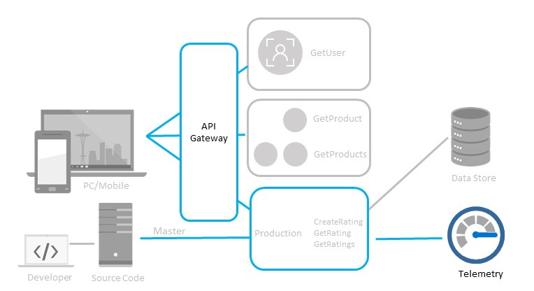

# System telemetry and API Management

## Progress Diagram



## Happy Path

### For Telemetry

Enable App Insights, then run the create the query provided in the solutions directory in App Insights Analytics:

### For API Management

* Try to coach towards the path of API Management. Features that will want to harness include
    * Reverse Proxy
    * Product Groups
    * Rate Limit policies

## Coaches Notes

* Explain to your team differences between API Management versus Proxies.
* APIM will not accept the email address with the "onmicrosoft.com" domain for the admin email. The team will need to use a valid email address in this field.
* Make them aware of how long a non Consumption based sku takes to deploy and if they want to go that way make them create the account ASAP. Otherwise the consumption sku is much faster to deploy and will contain the features required to accomplish the challenge.

## Challenge Steps:

### Step 1: Generate telemetry

1. Use the APIM Test tool or curl/postman to call each production rating function at least once:

   - CreateRating (POST with sample payload)
   - GetRating (GET with sample id)
   - GetRatings (GET)

1. This ensures telemetry (requests/duration) is recorded into App Insights.

Verify: You receive 200/expected responses from each function.

### Step 2: Query App Insights for calls and average duration

1. Navigate to Azure portal, **Application Insights** (choose the one linked to your Function App) and then **Logs**.

1. Paste this Kusto query into the query editor and Run to fetch the report:

   ```
   // Last 1 hour: count and avg duration per function
   requests
   | where timestamp >= ago(1h)
   | extend FunctionName = coalesce(tostring(customDimensions['FunctionName']), operation_Name, name)
   | summarize Calls = count(), AvgDurationMs = avg(duration/1ms) by FunctionName
   | project Function = FunctionName, Calls, AvgDurationMs
   | order by Function
   ```

### Step 3: Create a single APIM API and import functions

1. Navigate to Azure portal, under **API Management**, add your function app's API.

1. Select the Function App and functions you want imported.

1. Set API URL suffix to `bfyoc` (or ratings) so gateway URLs look like:

   ```
   https://<apim-name>.azure-api.net/bfyoc/<operation-path>
   ```

1. If `GetUser/GetProduct/GetProducts` live in another Function App, import them into the same APIM API or add them as additional operations pointing to that backend (Design → Backend → set backend URL).

1. Verify that the APIs see operations for GetUser, GetProduct, GetProducts, CreateRating, GetRating, GetRatings. Use the Test tab to call each operation via the APIM gateway URL.

### Step 4: Create three APIM APIs that expose only required operations

You will create three small front APIs that map to the same backend — this makes Product-to-operation mapping straightforward.

1. Add a **Blank API** under **APIM > APIs** (create one per product):

   - bfyoc-mobile : add operations GetUser, GetProduct, GetProducts, CreateRating, GetRating, GetRatings
   - bfyoc-internal : add operations GetProduct, GetProducts, GetRating, GetRatings
   - bfyoc-partners : add operations GetProduct, GetProducts

1. For each operation, set Backend to the single backend you configured in Step 4 (so all APIs route to same functions).

1. Verify that each new API has the correct operations listed under it.

### Step 5: Create APIM Products and assign APIs

1. Under **APIM > Products** create a new API.

   - Mobile Applications (name: Mobile Applications)
   - Internal business users (name: Internal business users)
   - External Partners (name: External Partners)

1. For each product under APIs tab, add the corresponding APIs:

   - Mobile Applications → add bfyoc-mobile
   - Internal business users → add bfyoc-internal
   - External Partners → add bfyoc-partners

1. Verify that Product APIs shows only the APIs/operations required.

### Step 6: Add rate-limit policies to the Internal and External products

1. Under **APIM > Products**, open Internal business users and under **Policies** replace the existing code with:

   ```
   <policies>
     <inbound>
       <base />
       <rate-limit calls="30" renewal-period="10" />
     </inbound>
     <backend><base /></backend>
     <outbound><base /></outbound>
     <on-error><base /></on-error>
   </policies>
   ```

1. Under **APIM > Products**, open External Partners and under **Policies** replace the existing code with:

   ```
   <policies>
     <inbound>
       <base />
       <rate-limit calls="60" renewal-period="15" />
     </inbound>
     <backend><base /></backend>
     <outbound><base /></outbound>
     <on-error><base /></on-error>
   </policies>
   ```

1. For Mobile Applications product, leave Policies untouched (no throttling).

1. Under **APIM** use the Product subscription key (Mobile, Internal, External) and note it in a notepad, you will use it in curl.

### Step 7: Functional testing with throttling behavior

Use bash/curl loops to simulate bursts.

Internal product test (should throttle after ~30 calls per 10s):

```
# replace <KEY> and <APIM_HOST>
for i in $(seq 1 40); do
  http_code=$(curl -s -o /dev/null -w "%{http_code}" -H "Ocp-Apim-Subscription-Key: <KEY>" "https://<APIM_HOST>/bfyoc/GetProducts")
  echo "$i -> $http_code"
done
```

Expect to see many 200 then 429 once the limit is hit.

External product test (60 calls / 15s):

```
for i in $(seq 1 80); do
  http_code=$(curl -s -o /dev/null -w "%{http_code}" -H "Ocp-Apim-Subscription-Key: <KEY>" "https://<APIM_HOST>/bfyoc/GetProducts")
  echo "$i -> $http_code"
done
```

Mobile product test (no throttling) — repeat with Mobile subscription key; should not return 429 for comparable bursts.

Verify that 429 responses appear for Internal and External when crossing limits; Mobile remains allowed.

