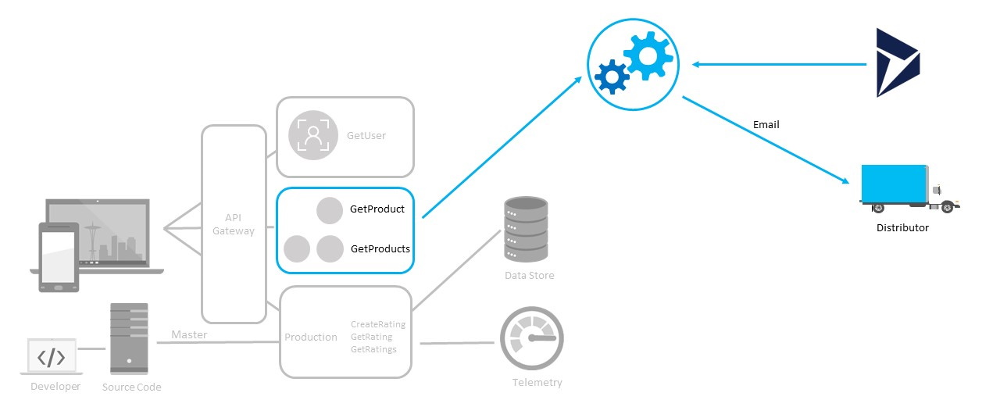

# Notify all distributors of the new ice cream line

## Progress Diagram



## Happy Path

One of these options

* Use Logic Apps, with the Common Data Service & Office 365 Email connectors, and the create HTML Table action or the variables actions  

* Use Logic Apps and Azure Functions together (LA for the Common Data Service and Office 365 Email connectors, and Functions to get the list of products and generate an HTML for it)  

## Coaches Notes

* The CRM Contacts have their email addresses set to two email addresses that you can use to validate the emails were sent. To validate, login with the following accounts OHCoach1@microsoftopenhack.onmicrosoft.com Pass: OpenHackCoach1, User: OHCoach2@microsoftopenhack.onmicrosoft.com, Pass: OpenHackCoach2 at [Office.com](https://outlook.office.com).

* Remember to "Add a new Connection" in Logic Apps when signing in to the Microsoft Dataverse connector connector and enter the credentials as per the challenge.  When entered correctly, the list of options will present.  Select `List Records` then build the logic app around that list with foreach control.

* Use the same connection for both the Microsoft Dataverse connector and the Office 365 Outlook connection

* Use Postman to trigger the logic app to test connections and data outside of the normal workflow.   Don't forget to set the header for content type to `'Content-Type' : 'application/json'`  

* Help them with running the Logic App without the full solution and checking the input/output of each action so they know how to extract the email from the Common Data Service connector response.  Easily create a foreach loop with a logic app connector and select the `Email` property for each contact.

   >NOTE: A solution is available at ~/solutions/codeless/Distributor_Notification/logicapp.json

* Instruct the teams to use the Office 365 Outlook connector to send an email if they need further help [Send Email (v2) action](https://docs.microsoft.com/en-us/connectors/office365connector/#send-an-email-(v2))  

* Attendees should construct the email content using Logic App variables, and insert the variable into the body of the email.  The entire email body could also be a composed variable for simplicity.

* If you get 'Failed to fetch swagger' when using the Azure Functions action in Logic Apps, go back to the function app, into CORS settings, remove all entries and add an entry for `*`.  

* There is a known bug with Logic Apps and the API Management connector, in that the connector is unable to retrieve the list of actions when using the **Consumption** tier of API Management. 

* If you get an error for Microsoft.EventGrid resource provider was not registered for the attendee subscription, make sure to follow the steps to register the EventGrid resource provider from [Register Event Grid as a resource provider](https://docs.microsoft.com/en-us/azure/event-grid/custom-event-quickstart-portal)


## Challenge Steps:

### Step 1: Create a Logic App

1. In the Azure portal, search for and navigate to **Logic App**. Create the logic app with the following settings:

   - Provide a unique name for your resource
   - Select the resource group **serverless-openhack**
   - Use any available region
   - Select the Plan Type as **Standard**
   - Click on **Review + Create > Create**.

1. Once deployed, open your Logic App in the designer.

1. In the Logic App Designer, click **+Add Trigger** and **When an HTTP request is received**.

1. Leave the **request schema** blank.

1. This will generate a trigger URL you can use to start the workflow manually or programmatically.

### Step 2: Initialize Email Body Variable

1. Click on **+New Step**, **Variable > Initialize variable** with the following settings.

   - Name: EmailBody
   - Type: String
   - Value: Paste the HTML template provided in the challenge.
   - Replace the <!-- LOOP THROUGH EACH PRODUCT HERE --> with a placeholder like {{ProductRows}}.

1. Click on **+New Step**, **Azure Functions > Execute Function**.

1. Select your subscription and the GetProducts function.

1. Output: JSON array of products with fields like ProductName, Description, ProductID.

### Step 3: Generate Product Table Rows

1. **Add Control > For Each** loop and input the **value** from the Azure Function output.

1. Inside the loop, add **Variable > Append** to string variable:

   - Name: EmailBody
   - Value:
     ```
     <tr>
        <td>@{items('For_Each')?['ProductName']}</td>
        <td>@{items('For_Each')?['Description']}</td>
        <td>@{items('For_Each')?['ProductID']}</td>
     </tr>
     ```

1. This dynamically adds all products to the email table.

### Step 4: Get Distributor Contacts from Dynamics 365

1. Click on **+New Step**, **Dataverse > List Rows** with the following settings.

   - Environment: Use your environment
   - Entity Name: Contacts
   - Authentication: Use the user contact email along with password

1. Output: Array of distributor contacts with Email field.

### Step 5: Send Email to Each Distributor

1. **Add Control > For Each** loop on the Dataverse contacts (value array).

1. Inside the loop, add **Office 365 Outlook > Send an email (V2)**:

   - To: @{items('For_Each_2')?['Email']}
   - CC: Your own email
   - Subject: Team [Your Team Number] - New Ice Cream Line
   - Body: @{variables('EmailBody')}
   - Is HTML: Yes

1. This will send the HTML email with the product table to each distributor contact.

### Step 6: Test the Logic App

1. Go to the HTTP request trigger and copy the generated URL.

1. Open Postman or any HTTP client and make a POST request to this URL.

1. Go back to the Logic App designer and check Run History.

1. Verify that the:

   - The workflow ran successfully.
   - Emails were sent to all distributor contacts.
   - HTML formatting and product table appear correctly.
