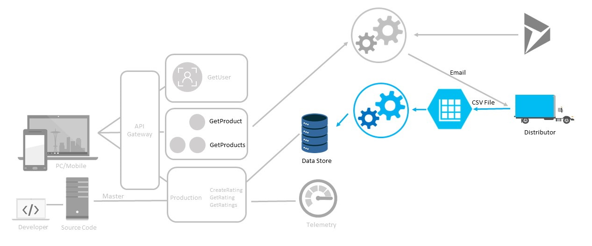

# Process distributor order batch files

## Progress Diagram

## Happy Path

One of the following options:

* Event Grid trigger to one Azure Function that queries if two files appear at the same time it might cause a problem reading the files at the same time from storage; create an extra file for each batch inside the function and put a lease on the file inside the function code and also add a retry whenever there is already a lease on the file to avoid this
* Event Grid to Azure Function that loads file contents to a SQL DB / CosmosDB and a separate function that checks from time to time if any have content for all three then merges them into a separate Cosmos collection
* Event Grid to Durable Functions that creates sub orchestrators for each batch when the first file arrives then RaiseEventAsync for the others; sub orchestrator runs an activity function with the details of all three files and the activity function parses and inserts the data (one per order) into Cosmos  
* Use Logic Apps with the batch trigger (one LA with event grid that sends info about the files to a second LA that has the batch trigger configured to release after 3 messages) and an Azure Function that is called by the batch triggered LA that handles the loading of the files, parsing, and inserting into Cosmos

## Coaches Notes

* This one might need more hands on by you to help them with their approach.

* When posting to register the storage account, the team should use a unique table number.  The API for post can be found [here](https://petstore.swagger.io/?url=https://serverlessohmanagementapi.azurewebsites.net/api/definition).  What matters is that the team table number is unique, such as seattle-table-1 or london-table-8.  If team table numbers are not assigned, encourage the teams to use a unique table name and to write it down as they will need it in future steps.  Please be aware this will send a great deal of traffic to their storage account for 48-72 hours.  Please inform them not to break the connection while the OH is active, as they need to keep the registration active for future challenges, and if they break the connection, they will get de-registered.

>NOTE: Student accounts will also be de-registered if more than 72 hours (3 days) have passed since registration.  If the student hits this threshold, have them re-register their storage account to restart the processing.

* The *serverlessohmanagementapi* application is case sensitive, so all parameters in the body must match exactly for each call, as well as there can be no case variation for filenames and links to the files in azure storage.  Review the swagger documentation for exact body composition requirements for each method.

* Durable Functions in Node.js is supported only for version 2.x of the Azure Functions runtime. Requires version 1.7.0 or later of the Durable Functions extension.

* Python and Java currently don't support durable functions. These teams will need to use alternate methods to accomplish this challenge.

* If the team's storage account container is private, the urls supplied to the /order/combineOrderContent endpoint must contain a SAS token.

* Cosmos DB Output binding doesn't allow for exception handling. Depending on the triggering approach the team uses this will manifest in different ways when errors occur during the saving to the database. Have the team discuss this and different ways of dealing with this.

* When the CosmosDB table is registered, a partition key is used, such as "id", "FileName", or "filename".  Assuming the partition key was "FileName", the logic app connector must connect and follow these setup instructions:  

    * DatabaseID: selected from connection  
    * CollectionID: selected from connection  
    * Document: Use left and right curly braces, then each field in quotes with each associated value, separated by commas.  **Do not forget to include your partition key and its value in this document.**  

    * Add a new parameter, and select "Partition Key Value".  In the resulting text box, add the partition key's value in quotes (to match the document above).  For example, the left hand would be non-editable text stating 'Partition key value' and there would be a text box on the right to enter information.  In that textbox, add the partition key's **value** in quotes, such as: **"myorderfile.xls"**.  Since the key is likely changing per run, encourage the use of a variable to store the partition key's value.  

* When writing to CosmosDB in Logic Apps the Partition Key parameter needs to be added as a new parameter to the CosmosDB Create or Update document connector. The value needs to be surrounded by quotes.  The partition also needs to be sent as part of the body of the document to create.  If you don't see your partition key's value in both the document and the Partition Key Value parameter, the create or update document will not work.   Additionally, you can review the designer JSON and validate that the "x-ms-documentdb-raw-partitionkey" is set with a value.  

* If you get an error for Microsoft.EventGrid resource provider was not registered for the attendee subscription, make sure to follow the steps to register the EventGrid resource provider from [Enable Event Grid Resource Provider](https://docs.microsoft.com/en-us/azure/event-grid/custom-event-quickstart-portal)  
