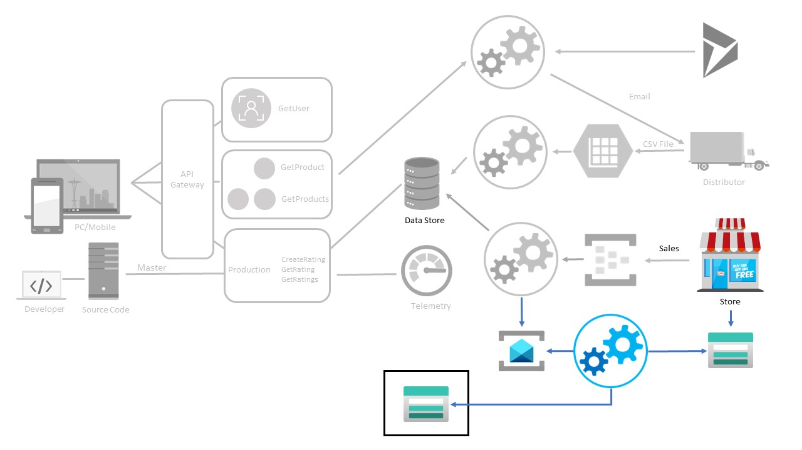

# Pub/Sub and Network Integration

## Process Diagram



## Overview

The primary objective of this challenge is to expose participants to the following concepts:

* Azure Functions Premium with virtual network integration
* Pub/Sub via Azure Service Bus topics and subscription filters (filtering events that need extra action)
* Messaging claim check pattern

## Happy Path

* Participant should create a new Service Bus topic to which to send messages.
* Modify the Azure Function used in the prior challenge to publish messages to a new Service Bus topic **only** if there is a ```receiptUrl``` in the data received from Event Hub.
    * Use the UserProperties of a Service Bus Message/BrokeredMessage type. The new property will need to have a key such as "TotalCost" and a value such as 134.59.  The property can be used by a Service Bus SQL filter for a subscription.
    * It is possible to use an output binding if using C#.
* Create two Service Bus subscriptions, one to handle all messages, and one to handle only messages where the total cost is greater than $100.  
* Create two functions (within the Functions Premium plan) to act as subscribers.  There should be one function per subscription.
* For the function which retrieves and base64 encodes the PDF:
    * use a Service Bus trigger to receive the message
    * use a blob output binding with [blob output binding for a random guid](https://docs.microsoft.com/azure/azure-functions/functions-bindings-expressions-patterns#create-guids) to set the file name
    * the receiptUrl should be a reference to an Azure storage blob using a SAS URL, and thus should be downloadable within the Azure function.
* Use the provided VM to view the files in Azure blob storage.  Remotely access the VM (using RDP) and then log into the Azure Portal (using the Azure credentials for the OpenHack).  Navigate to the Storage Explorer in the portal and then browse to view the files in blob storage.

## Coach's Notes

* VM (Jumpbox) Notes
    * *Username:* serverless
    * *Password:* ServerlessForAll2019
    * VM will automatically shut down at 19:00 UTC each day
* The following Azure resources should be provisioned in advance within the participant's Azure subscription:
    * 2 storage accounts
        * one for the VM's diagnostic data (storage account name should begin with 'sohvmdiag')
        * one for the storage of receipts (storage account name should begin with 'sohsales').  There should be two containers within this storage account: 'receipts' and 'receipts-high-value'
    * 1 Virtual Machine ('soh-jumpbox)
        * OS is Windows 10
        * VM uses a DevTestLab schedule to automatically shut down daily at 19:00 (no notification)
    * 1 Virtual Network ('soh-vnet')
        * 2 subnets
            * 'receipt-processing' - this is for use by the compute resource (ideally an Azure Functions Premium plan) used to process messages for this challenge
            * 'jumpbox' - this is for use exclusively by the VM
        * Subnets are configured with a virtual network service endpoint for access to Microsoft.Storage resources only.
        * 1 NSG to allow RDP access on port 3389

The diagram below depicts the Azure resources which are created for each team's Azure subscription.


## Challenge Steps:

### Step 1: Create Azure resources

1. Navigate to Azure portal, search for **Virtual Network** and create a new virtual network.

1. Use the resource group **serverless-openhack** and create two subnets **receipt-processing** and **jumpbox**.

1. Configure the service endpoints for `Microsoft.Storage` on both the subnets.

1. On the Azure portal, create a Service Bus Namespace:

   - Tier: Standard
   - Region: same as VNet and Function App

1. Create a Topic inside the service bus with the an unique name (sales-receipts).

### Step 2: Modify Azure Function to Publish Messages

1. For the Event Hub Trigger, use your existing function from the previous challenge to receive POS events.

1. Check for Receipt and proceed if `receiptUrl` exists in the POS message.

1. Construct the JSON message:
   
   ```
   {
       "totalItems": 8,
       "totalCost": 123.40,
       "salesNumber": "0c423398-3c7c-0682-7519-4701c445ed7a",
       "salesDate": "09/11/2019 06:04:43",
       "storeLocation": "00d8ea6f-935c-2cca-9bbc-f56b5a091621",
       "receiptUrl": "https://serverlessohsales.blob.core.windows.net/TheReceipt.pdf"
   }
   ```

1. Add Service Bus Output Binding

   - C# example in function.json:
     ```
     {
       "type": "serviceBus",
       "direction": "out",
       "name": "outputMessage",
       "topicName": "sales-receipts",
       "connection": "ServiceBusConnectionString"
     }
     ```


1. Set User Property for Filtering to include TotalCost as a user property in the Service Bus message.

### Step 3: Create Subscriber Functions

1. High-Value Receipts Function

   - Service Bus Trigger - high-value-receipts subscription
   - Download PDF from receiptUrl (SAS URL)
   - Base64 encode the PDF
   - Construct JSON including ReceiptImage
   - Save JSON to receipts-high-value container with random GUID as filename

1. All Receipts Function

   - Service Bus Trigger - all-receipts subscription
   - Construct JSON without base64 encoding
   - Save to receipts container with random GUID as filename

1. Blob Output Binding

   - Use binding expression to generate random GUID filenames:
     ```
     "path": "receipts-high-value/{rand-guid}.json"
     ```

### Step 4: Integrate Function App with VNet and Test

1. Enable VNet Integration inside the Function App, **Networking > VNet Integration** and select receipt-processing subnet.

1. Test Storage access under Functions, which should be able to write to sohsales containers via service endpoints.

1. Send Test Events inside the Event Hub and inject POS events with varying totalCost and receiptUrl.

1. Check Service Bus Routing to ensure messages are correctly routed by filters:

   - high-value-receipts: messages ≥ $100
   - all-receipts: all messages

1. Verify Blob Storage by navigating to the **Storage Explorer** of your Storage acount.

1. Check JSON files in:

   - receipts-high-value - contains base64 encoded PDFs
   - receipts - contains standard JSON messages
