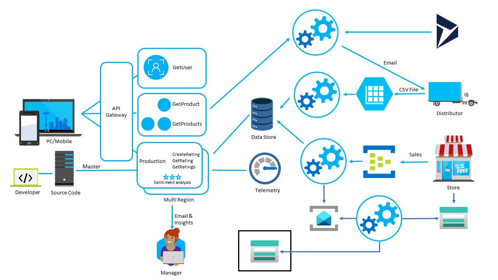

# Putting it All Together

## Progress Diagram



## Happy Path

* Change feed + Functions to forward to a new Event Hub, or modify CreateRating function with a new second output binding to Event Hub
* Create Stream Analytics solution with original POS Event Hubs & new new Event Hub as input
* Write one or more Stream Insight queries then output to Cosmos or to PowerBI. Example:

```sql
WITH
Products AS (
    Select *
    from testdata as t
    CROSS APPLY GetArrayElements(t.items) AS flat
)

SELECT System.TimeStamp AS WindowEnd,
        T.header.locationname,
        flat.ArrayValue.productname,
        sum(flat.ArrayValue.totalcost) as totalCost,
        count(1) as countUnits
INTO prodPowerBi
FROM Products
GROUP BY flat.ArrayValue.productname, T.header.locationname, TumblingWindow(minute, 5)
```
## Challenge Steps:

### Step 1: Event Forwarding

1. Forward POS sales, distributor orders, and reviews with sentiment into a common Event Hub (aggregator-events).

1. Use an Azure Function (Cosmos DB trigger or by modifying `CreateRating`) to forward reviews into the Event Hub.

1. POS and distributor events should also be sent/forwarded into the same Event Hub.

### Step 2: Stream Analytics Job

1. On the Azure portal, create a new **Stream Analytics** job.

1. Add inputs:

   - POS Event Hub (original).
   - Distributor orders Event Hub (original).
   - Aggregated reviews Event Hub (aggregator-events).

1. Add outputs as Cosmos DB or Power BI.

### Step 3: Stream Analytics Query

1. Use a query that:

   - Aggregates distributor orders totals (sum cost, count units).
   - Aggregates POS sales totals (sum cost, count units).
   - Aggregates average sentiment for reviews.
   - Groups all by product name over a 5-minute tumbling window.

   - Example:

   ```
   WITH DistributorAgg AS (
       SELECT
           flat.ArrayValue.productName AS productName,
           SUM(flat.ArrayValue.totalCost) AS distributorTotalSales
       FROM distributorInput TIMESTAMP BY EventEnqueuedUtcTime
       CROSS APPLY GetArrayElements(items) AS flat
       GROUP BY flat.ArrayValue.productName, TumblingWindow(minute, 5)
   ),

   PosAgg AS (
       SELECT
           flat.ArrayValue.productName AS productName,
           SUM(flat.ArrayValue.totalCost) AS posTotalSales
       FROM posInput TIMESTAMP BY EventEnqueuedUtcTime
       CROSS APPLY GetArrayElements(items) AS flat
       GROUP BY flat.ArrayValue.productName, TumblingWindow(minute, 5)
   ),

   SentimentAgg AS (
       SELECT
           productName,
           AVG(sentimentScore) AS averageSentiment
       FROM reviewInput TIMESTAMP BY EventEnqueuedUtcTime
       GROUP BY productName, TumblingWindow(minute, 5)
   )

   SELECT
       COALESCE(d.productName, p.productName, s.productName) AS productName,
       ISNULL(d.distributorTotalSales, 0) AS distributorTotalSales,
       ISNULL(p.posTotalSales, 0) AS posTotalSales,
       ISNULL(s.averageSentiment, 0) AS averageSentiment,
       System.Timestamp() AS windowEnd
   INTO outputReport
   FROM DistributorAgg d
   FULL OUTER JOIN PosAgg p
     ON d.productName = p.productName
        AND DATEDIFF(minute, d, p) = 0
   FULL OUTER JOIN SentimentAgg s
     ON COALESCE(d.productName, p.productName) = s.productName
        AND DATEDIFF(minute, COALESCE(d, p), s) = 0;
   ```

### Step 4: Output Report

1. The Cosmos DB output will store the aggregated report per product per 5-minute window.

1. The Power BI output will let your coach see the report live (lists of products by distributor totals, POS totals, and average sentiment).
