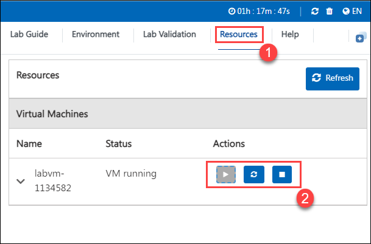

# Microsoft Azure Serverless OpenHack

Serverless computing allows for scalable and reliable event based processing for code and workflows. It accelerates the development of applications while hiding the infrastructure and providing auto-scale and micro-billing. Serverless technologies like Azure Functions, Logic Apps, and Event Grid are some of the services being adopted by development teams in startups, ISVs, and enterprises to implement new or extend existing solutions. Companies that adopt serverless benefit from a fast time to market and only pay for what they use.

These services work in combination with other Azure services and form the core of this OpenHack and underpin everything you'll be exploring as you progress through the challenges.

## Best For You Organics Company

**Best For You Organics Company (BFYOC)** is an ice cream company with over 200 stores worldwide. BFYOC has focused on fresh ingredients, locally sourced, and seasonal. Their 26 flavors range from the ordinary vanilla, to the ever popular avocado toast (which is a much better flavor than it sounds). They are now creating a new line of fruit flavored ice creams and are preparing to launch onto the market.

Because premium ingredients is key to their success, their profit margins are relatively low, as they try to keep prices affordable for consumers. As such, every sale needs to be optimized, and every customer needs to leave happy. They also need to cut costs whenever possible, which of course impacts their budget for new technology.

BFYOC would like to launch a new customer feedback tool to analyze their sales and customer satisfaction levels. Because feedback posts from customers will be sporadic, they are looking for options that can automatically scale, and minimize investment in infrastructure.

In addition, they would like to streamline their inventory and ordering process to reduce costs and product waste. They want to be able to notify distributors of new ice creams, and automate the processing of new orders based on inventory.

## Getting Started with the Hackathon

Welcome to your Microsoft Azure Serverless OpenHack Hackathon! We have prepared a seamless environment for you to explore and learn about Azure services. Let's begin by making the most of this experience:
 
## Accessing your Hackathon Environment
 
Once you are ready to dive in, your virtual machine and hackathon guide will be right at your fingertips within your web browser.

### Virtual Machine & Hackathon Guide
 
Your virtual machine is your workhorse throughout the workshop. The hackathon guide is your roadmap to success.
 
## Exploring your Hackathon Resources
 
To get a better understanding of your hackathon resources and credentials, navigate to the **Environment** tab.
 

 
## Utilizing the Split Window Feature
 
For convenience, you can open the hackathon guide in a separate window by selecting the **Split Window** button from the top right corner.
 

 
## Managing your Virtual Machine
 
Feel free to **Start, Stop, or Restart** your virtual machine as needed from the **Resources** tab. Your experience is in your hands!

## Lab Guide Zoom In/Zoom Out
 
To adjust the zoom level for the environment page, click the **A↕ : 100%** icon located next to the timer in the lab environment.

## Let's get started with the Azure Portal

1. On your virtual machine, click on the **Azure Portal** icon as shown below:
 
   

1. On the **Sign in to continue to Microsoft Azure** tab, you will see the login screen. In that, enter the following email/username and click on **Next**. 

   * **Email/Username**: <inject key="AzureAdUserEmail"></inject>
   
     
     
1. Now, enter the following password and click on **Sign in**.
   
   * **Password**: <inject key="AzureAdUserPassword"></inject>
   
     

1. At the **"More information required"** prompt, select **Next**.
  
1. On the **"Keep your account secure"** page, select **Next** twice.

1. **Note:** If you don’t have the Microsoft Authenticator app installed on your mobile device:

   - Open **Google Play Store** (Android) or **App Store** (iOS).
   - Search for **Microsoft Authenticator** and tap **Install**.
   - Open the **Microsoft Authenticator** app, select **Add account**, then choose **Work or school account**.

1. A **QR code** will be displayed on your computer screen.

1. In the Authenticator app, select **Scan a QR code** and scan the code displayed on your screen.

1. After scanning, click **Next** to proceed.

1. On your phone, enter the number shown on your computer screen in the Authenticator app and select **Next**.

1. If prompted to stay signed in, you can click **No**.

1. If a **Welcome to Microsoft Azure** pop-up window appears, simply click **Cancel** to skip the tour.
   
## Support Contact
 
The CloudLabs support team is available 24/7, 365 days a year, via email and live chat, assuring seamless assistance all the time. We offer dedicated support channels tailored specifically for learners and instructors, ensuring that all your needs are efficiently addressed.

Learner Support Contacts:
- Email Support: cloudlabs-support@spektrasystems.com
- Live Chat Support: https://cloudlabs.ai/labs-support

Now, click on **Next** from the lower right corner to move on to the next page.

### Happy Hacking!!
