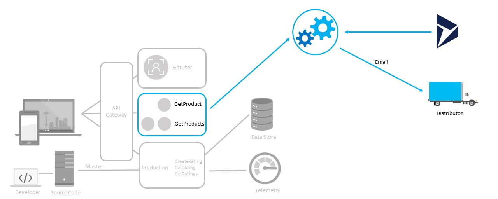

# Notify all distributors of the new ice cream line

## Background

The food development, marketing, production, and quality teams at Best For You Organics (BFYOC) have released the details about their new line of ice creams to the sales department. The sales department has now asked your team to allow for notification of the main contact at each distributor with the information about the new line so they can review and start sending in orders.

In this challenge you will create a workflow between Best For You Organics CRM systems (Dynamics 365) and the company's distributors.  

## Challenge

Your team should implement an HTTP triggered workflow that will generate an HTML email with the list of products, and then send an email to each of the main contacts at the distributors.

BFYOC has provided HTML that you can use as a starting point for the body of the emails.  

**Note that this HTML includes a section that you need to programmatically loop through each product to finish creating the table.**

```HTML
<!DOCTYPE html>
<html>
<body style="background-color: whitesmoke; color: #454545; font-family:'Gill Sans',
 'Gill Sans MT', Calibri, 'Trebuchet MS', sans-serif; padding-bottom: 3em;">
  <table style="width:100%; color:#454545">
    <tr>
      <td style="width:11em;">
        
      </td>
      <td>
        <p style="font-style: italic; font-size: 50px;
        font-weight:600; margin-left: 1em;">Best For You Organics</p>
      </td>
    </tr>
  </table>
  <p style="text-align: center; font-style: italic; font-size:
  80px;">New Ice Cream Line!</p>
  <p style="margin:2em 0em; font-size: 20px; text-align: center;">
  Best For You Organics have a new line of fruit flavored ice creams.
  Below is the information so you can start the ordering process:
  </p>
  <table style="width:100%; border-top: 1px solid #454545;
  border-bottom: 1px solid #454545; color:#454545; padding: 1em; font-size: 20px;">
    <thead>
      <tr>
        <th style="padding-bottom: 1em;" align="left">Ice Cream</th>
        <th style="padding-bottom: 1em;" align="left">Description</th>
        <th style="padding-bottom: 1em;" align="left">Product ID</th>
      </tr>
    </thead>
    <tbody style="font-size: 16px;">
  <!-- LOOP THROUGH EACH PRODUCT HERE AND CREATE A TABLE ROW ENTRY FOR EACH -->
    </tbody>
  </table>
  <p style="text-align: center; margin-top: 3em;font-size: 20px;">Please contact
  your representative at Best For You Organics to get more information..</p>
</body>
</html>
```

You can access the list of products via the `GetProducts` method in the existing Azure Function in your subscription.

You can retrieve the main contacts of the distributors from the distributor's Dynamics 365 CRM systems with the following detail:

* User: `duser@microsoftopenhack.onmicrosoft.com`

* Password: `pass@word1`

* Environment: `Microsoft OpenHack (msftopenhack)`

* Entity: `Contacts`

> Viewing records to select the entity from the distributor's Dynamics 365 CRM system can take several seconds. Please be patient.

The `Email` field from each contact contains the email address to be used for each distributor contact.  

The email should also contain your team number in the subject. Feel free to also add the email address of someone in your team in CC so you can see what the emails look like.

>HINT: The same credentials for user and password as listed above can also be used to send emails from `Office 365 Outlook` Add your own email address to the list and/or review the workflow executions to see the emails sent to validate the emails are sent as expected to multiple distributors.  

## Success Criteria

* The email looks correct in an HTML format and with the list of products

* Your coach will be able to validate that the distributors have received the email with your HTML content

* Make sure your team number is in the email subject

* Once the coach has validated the email, show the implementation to them

## References  

* [Connect to Microsoft Dataverse from workflows in Azure Logic Apps](https://learn.microsoft.com/en-us/azure/connectors/connect-common-data-service)  

* [List Records using a Common Data Service (Microsoft Dataverse) connector](https://docs.microsoft.com/en-us/azure/connectors/connect-common-data-service#list-records-based-on-a-filter)  

* [Office 365 Connector](https://docs.microsoft.com/en-us/connectors/office365/)  

* [Loops in Logic Apps](https://docs.microsoft.com/azure/logic-apps/logic-apps-control-flow-loops)  

* [Create variables for saving and managing values in Azure Logic Apps](https://docs.microsoft.com/azure/logic-apps/logic-apps-create-variables-store-values)  

* [Perform data operations in Azure Logic Apps](https://docs.microsoft.com/azure/logic-apps/logic-apps-perform-data-operations)  

* [Logic Apps workflow actions and triggers](https://docs.microsoft.com/azure/logic-apps/logic-apps-workflow-actions-triggers)  

## Progress Diagram


