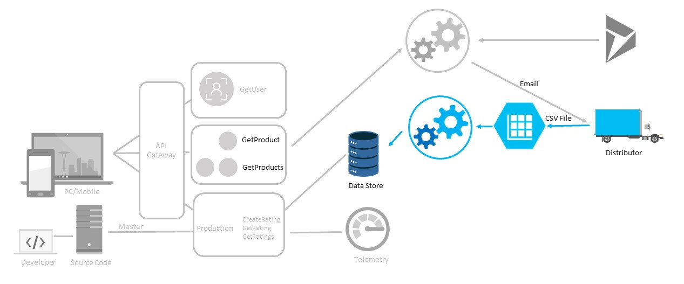

# Process distributor order batch files

## Background

Best For You Organics Company (BFYOC) receives orders from distributors
via flat files, similar to that of many businesses. These files come in
batches of three, however each file can come in at different times. BFYOC
would like your team to create an implementation that can process the files
as a batch, storing the data contained as a single JSON object in a database.

## Challenge

The purchase order information from some of the distributors arrive in
batches. Each batch is made up of exactly three different files, each with
different information about orders, as described below:

* Type 1: order header details.
For example: `20180518151300-OrderHeaderDetails.csv`

* Type 2: order line items. For example:
`20180518151300-OrderLineItems.csv`

* Type 3: product information for the batch.
For example: `20180518151300-ProductInformation.csv`

For these example file names the batch that binds them together is the file
name prefix `20180518151300`.  Be sure to review the contents of the files, as a single order header details file may contain multiple orders.

Before continuing to the challenge, create a Storage Account of kind
`StorageV2 (general purpose v2)` in your Azure Subscription, and then create
a new Blob container in it.

You will be required to post your team table number, the storage account
connection string, and the blob container name. The distributor systems will
start sending batches of flat files with order details into your blob storage
container every 1 minute. The date based prefix of the file names will indicate
what files belong to the same batch.  

>HINT: Your team table number will be assigned if one exists.  If not, you will need to create a unique table name such as `<yourcity>-table-<sometablenumber>`.  You will need this table number in future challenges, so you may wish to write it down or keep it somewhere you can easily retrieve for future registrations. Review the swagger documentation or discuss with your coach for more information.

Make an HTTP POST call to the `/team/registerStorageAccount`
endpoint of the [Serverless OpenHack API System](https://petstore.swagger.io/?url=https://serverlessohmanagementapi.azurewebsites.net/api/definition) to register your team's storage account.

**Take note of the teamTableNumber used in this registration. It will be required in later challenges.**

**Make sure to note that the API is case-sensitive, so all parameters and parameter values must match case.  Review the swagger documentation to make sure you have the BODY composed correctly [here](https://petstore.swagger.io/?url=https://serverlessohmanagementapi.azurewebsites.net/api/definition#/Register%20Storage%20Account/register)**

Your challenge is to work as a team to create a solution that:

* Waits until all the files for the same batch arrive before processing them.

* Once all three files for a batch have been received, make an HTTP POST call to the `/order/combineOrderContent`
endpoint of the [Serverless OpenHack API System](https://petstore.swagger.io/?url=https://serverlessohmanagementapi.azurewebsites.net/api/definition#/Register%20Storage%20Account/combineOrderContent), which will combine the content and return a single JSON document per order.

* Insert the JSON document of each order into your database as a separate
entry/record.

**Note: The Serverless Open Hack will periodically check team registrations
and delete those with invalid storage accounts and services used in later
challenges. To ensure your team's registration isn't deleted, be sure not to
delete the Azure services used here and subsequent challenges.**

>HINT: Make sure to register EventGrid as a resource provider on your Azure Subscription before trying to respond to storage events.  Failure to register Event Grid will result in an inability to create subscriptions that respond to Azure storage events

## Success Criteria

* Demonstrate to your coach how you implemented the workflow to read, combine,
and insert the data from the batches of flat files into one JSON document per
order into a database. All the details from the flat files need to be in the
JSON documents generated.

## References  

* [Register Event Grid](https://docs.microsoft.com/en-us/azure/event-grid/custom-event-quickstart-portal)  

* [An introduction to Azure Event Grid](https://docs.microsoft.com/azure/event-grid/overview)

* [Event Grid: Reacting to Blob Storage events](https://docs.microsoft.com/azure/storage/blobs/storage-blob-event-overview)

* [Durable Functions overview](https://docs.microsoft.com/azure/azure-functions/durable-functions-overview)

* [Send, receive, and batch process messages in Logic Apps](https://docs.microsoft.com/azure/logic-apps/logic-apps-batch-process-send-receive-messages)

## Progress Diagram

